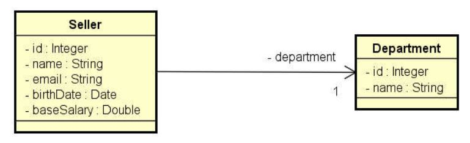

<h1 align="center"> Projeto JDBC utilizando o padrão DAO(Data Acess Object) </h1>

Projeto em Java utilizando a API JDBC com o padrão DAO e com a utilziação do banco de dados relacional MySQL   

  <a href="#rocket-tecnologia">Tecnologias</a>&nbsp;&nbsp;&nbsp;|&nbsp;&nbsp;&nbsp;
  <a href="#computer-projeto">Projeto</a>&nbsp;&nbsp;&nbsp;

  

 

## :rocket: Tecnologia

Esse projeto foi desenvolvido com a seguinte tecnologia:

- Java
- JDBC
- MySQL 

## :computer: Projeto

Como informado, este projeto foi feito com o padrão DAO, que por sua vez aplica para cada entidade um objeto responsável por fazer acesso a dados relacionado a esta entidade.

Abaixo nós temos o diagrama UML do projeto e lá identificamos duas entidades do negócio: 'Department' e 'Seller'.

E então o que será feito?

As entidades 'Department' e 'Seller' terão uma outra classe(objeto) que serão responsáveis por fazer o acesso a dados no banco de dados pela JDBC. Acesso a dados seria basicamente o CRUD (Create, Read, Update, Delete).

Mas precisamos antes linkar com outro banco de dados relacional a sua escolha. E para isso criamos as interfaces 'DepatmentDao' e 'SellerDao' para cumprir as operações independente do banco de dados relacional utilizado.

E eu posso mudar de tecnologia ou preciso usar somente a JDBC?
R: Pode, e quem faz o papel da instanciação é o Objeto 'DaoFactory'

A classe 'DaoFactory' no projeto é responsável por instanciar a conexão do banco de dados com a API desejada(JDBC nesse caso). E suas operações retornam um novo objeto, responsável por cumprir os contratos da interface mencionada na operação.

E lá na interface encontramos as seguintes operações: findAll, findByID, insert, update, deleteByID.

E quem irá executar elas?
R: As classes implementadas: 'SellerDaoJDBC' e 'DepartmentDaoJDBC' 

### AVISO

Esse projeto não tem por finalidade apresentar sua utilização para o público.

Ele tem por conceito aplicar somente os conhecimentos estudados pela plataforma de ensino Udemy Academy.

#### Diagrama Entities UML

